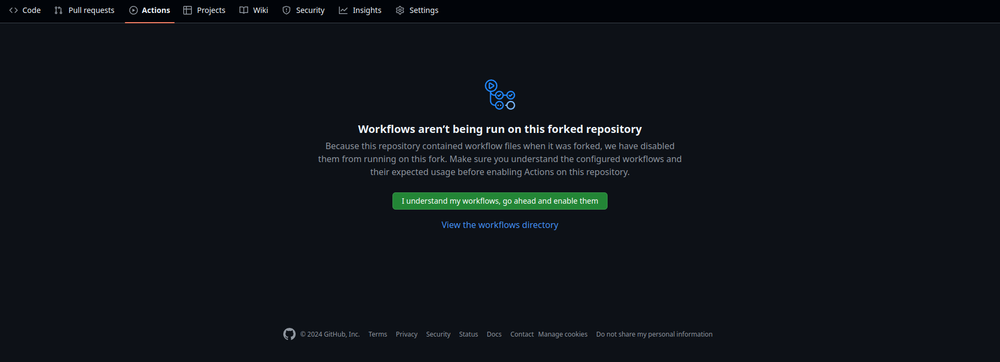
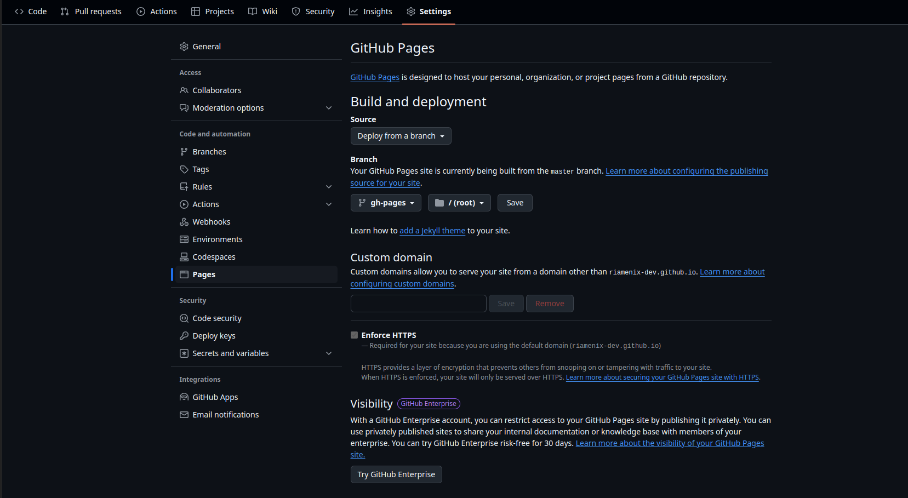

# Slick Portfolio With Svelte.

Vercel-like style portfolio template for developers.

[Fork of slick-portfolio-svelte-5](https://github.com/RiadhAdrani/slick-portfolio-svelte-5), customized for my portfolio. This fork adds a Nodemailer-powered contact form (via SvelteKit server actions), `.env`-based configuration, and guidance for managing images/SSR and content updates under `src/lib/data`.

[For a reference, check out my personal protfolio.](emilioguarino.com)

## Libraries

The main libraries used here are :

- `shadcn-svelte` : component library.
- `tailwindcss` : css styling.
- `unocss` : fonts and icons.
  - using `carbon` (and thus the icon names `i-carbon-*`) icons that could be browsed [here](https://icones.js.org/collection/carbon)
- `mode-watcher` : color mode utility.
- `prismjs` : markdown parsing in combination with `marked`, `marked-mangle`, `marked-gfm-heading-id` and `dompurify`.

## What this fork adds

- Contact form wired to SvelteKit server actions and Nodemailer
- Environment-based configuration via `.env`
- Guidance for image paths (hero/bio images) with SvelteKit base path
- Notes about SSR and static hosting limits (GitHub Pages)

## Create

You can either clone or fork this repository :

### `fork`

You can fork the project, maintaining a link to the original repo using the `fork` button, make sure the check the `Copy the master branch only` checkbox.


### `clone`

- using `git` :

```bash
# ssh
git clone git@github.com:RiadhAdrani/slick-portfolio-svelte-5.git protfolio

# https
git clone https://github.com/RiadhAdrani/slick-portfolio-svelte-5.git protfolio
```

- using `degit` npm executable :

```bash
npx degit RiadhAdrani/slick-portfolio-svelte-5 portfolio
```

if you don't have `degit`, it will prompt you to accept, enter `y`.

> You can add the main repo as another remote repo to maintain updates in the future.
>
> ```bash
> # ssh
> git remote add main git@github.com:RiadhAdrani/slick-portfolio-svelte-5.git
> ```

## Deploy to GitHub pages

Before deploying to `GitHub Pages`:

### Enable workflows for `Forks`

If you forked the repo, go to the `Actions` tab in the newly generated repository, and enable workflows, click on the green button `I understand my workflows, go ahead and enable them` :



### Actions Settings

Allow `GitHub Pages` in your repo settings with correct permissions:

- go to your repo `Settings` > `Actions` > `General`
- in `Actions permissions` : make sure that `Allow all actions and reusable workflows` checkbox is checked


### svelte.config.js

Depending on the name of your repository, you would like to set the `base` variable to that, starting with a leading slash like this:

```js
const base = '/slick-portfolio-svelte';
```

But if your repository name is the same as your Github domain name; my Github name is `RiadhAdrani` so my domain name is `riadhadrani.github.io` (lower cased), and so the special repository name is also `riadhadrani.github.io`: if that is the case, you need to set the base to an empty string

```js
const base = '';
```

> Note: This template uses `@sveltejs/adapter-static` for GitHub Pages. Server actions do not run on static hosting. The contact form will work locally during development but will require a server-capable adapter (e.g., Vercel/Netlify/Node) or an external mail API in production. See "Contact form" below.

### Launching the build and deploy workflow

If you didn't commit and push the changes in the `svelte.config.js` yet, you can do that now, otherwise you can create an empty commit:

```bash
git commit --allow-empty -m "chore: trigger workflow"
```

and push it to your `master` or `main` branch.

In the `Actions` tab, make sure that the `Build and Deploy` workflow is successful (wait for it to complete): you should have at least one successfull workflow run:


### Enable GitHub pages

- go to your repo's `Settings` > `Pages`
- in Source section, select `Deploy from a branch`.
- in Branch section, select `gh-pages` and `/ (root)` and click on save



Again in the `Actions` tab, make sure that the `pages-build-deployment` workflow is successful (wait for it to complete): you should have at least one successfull workflow run:


> If for some reason no action was launched, try pushing empty commit.

## That's it

That's it, you can click on the latest deployment and visit it.

## Adapt to your needs

If you want to use the template as it is, you can :

- update files in `src/lib/data` with your data.
- update `src/lib/index.css` for custom styling.
- update `src/lib/index.css` for custom markdown styling.

- update `static/favicon.png` to customize the tab's icon.

- You can find `shadcn-svelte` component in `src/lib/components/ui`, other components are arranged by their page, or in the `common` folder.

But feel free to explore and hack the template to your needs if you feel like it.

## Local development

- Install deps and run:

```bash
npm i
npm run dev
```

- Type/lint:

```bash
npm run check
npm run lint
```

## Contact form (server action + Nodemailer)

This project includes a contact form at `src/routes/contact`. It posts to a SvelteKit server action in `src/routes/contact/+page.server.ts`, which sends mail via Nodemailer.

1) Create `.env` in the project root (same folder as `package.json`):

```env
NODEMAILER_LOGIN=your-gmail@example.com    # full Gmail address
NODEMAILER_PW=your-app-password            # Gmail App Password (not your regular password)
FORWARD_MAIL_TO=recipient@example.com      # where to receive messages
```

2) Restart `npm run dev` after changing `.env`.

3) Local SSR is enabled in `src/routes/+layout.ts`:

```ts
export const ssr = true;
export const prerender = false;
```

4) Production note (important): GitHub Pages (static) cannot run server actions, so the contact form cannot send emails there. To enable email in production, either:

- Deploy with a server-capable adapter (e.g., Vercel/Netlify/Cloudflare/Node), or
- Keep GitHub Pages and use a third-party/mail API (e.g., Resend/EmailJS/Formspree) from the client or via serverless functions.

## Updating content

- Most content lives in `src/lib/data/*.ts` (e.g., `home.ts`, `bio.ts`, `experience.ts`, `education.ts`, `projects.ts`, `skills.ts`, `nav-bar.ts`). Update text, links, and lists there.
- Markdown content can live under `src/lib/data/md/` and be rendered via the provided markdown components.

## Images (hero/bio) and base path

- Put public images in `static/images/...` so they are served directly.
- When referencing images in code that is rendered both on server and client, use SvelteKit’s base path:

```ts
import { base } from '$app/paths';

const heroImage = `${base}/images/full-picture-emilio.jpg`;
```

- In Svelte components:

```svelte
<script lang="ts">
  import { base } from '$app/paths';
</script>


```

- Alternatively, import images from `src` and use the imported URL:

```svelte
<script lang="ts">
  import hero from '$lib/assets/images/full-picture-emilio.jpg';
</script>


```

## UI hydration warnings (Bits UI triggers)

If you see warnings about `<button>` inside `<button>`, use the `asChild`/`builder` pattern to avoid nested buttons:

```svelte
<TooltipTrigger asChild let:builder>
  <Button builders={[builder]}>Hover me</Button>
</TooltipTrigger>

<DialogTrigger asChild let:builder>
  <Button builders={[builder]}>Open</Button>
</DialogTrigger>
```

## Optional blog / news options

- Easiest: publish on Substack/Medium and render posts via RSS on a `/blog` page (instant updates, no redeploys)
- Git-based CMS with in-repo content editing UI: Decap CMS or TinaCMS
- Hosted headless CMS: Contentful/Sanity/Hygraph (fetch at build; rebuild via webhooks)

## Known issues:

- Svelte no longer support `node 14`, use a newer version instead.
